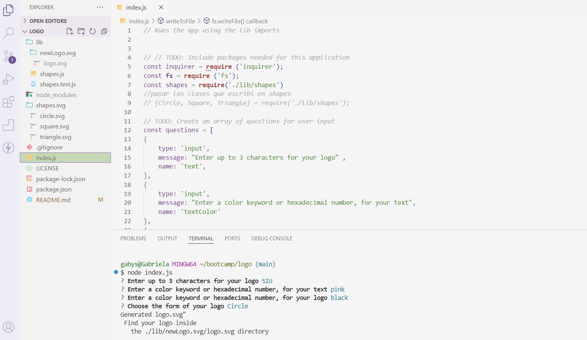
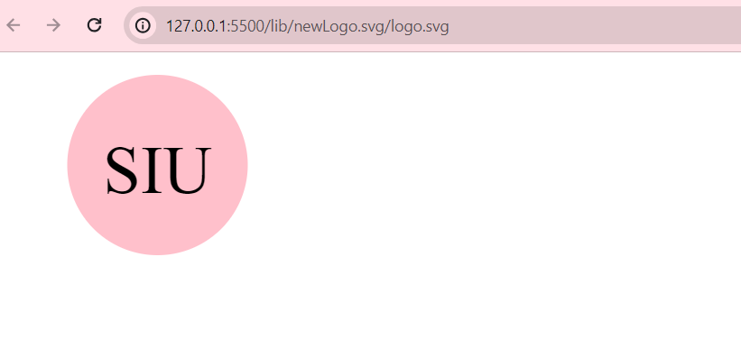

# My Logo Generator

## Description
Through this app, users will be able to create their own logo by answering
a set of prompts in the console.  
Once they've finished adding what's been asked, then a new logo.svg file will e created 
with the specifications in it. 
For this challenge I used my recently learned knowledge on javascript, 
node, and test.js. I also used tools like inquire and learnt how to export and import modules.

You can see my code in action HERE ---> https://drive.google.com/file/d/1Qym5mIoIFp6Tj9Z0nUOX5tIRVvntHXOc/view
You can enter to my gitHub repository HERE ---> https://github.com/Gabrielasiu/logo

